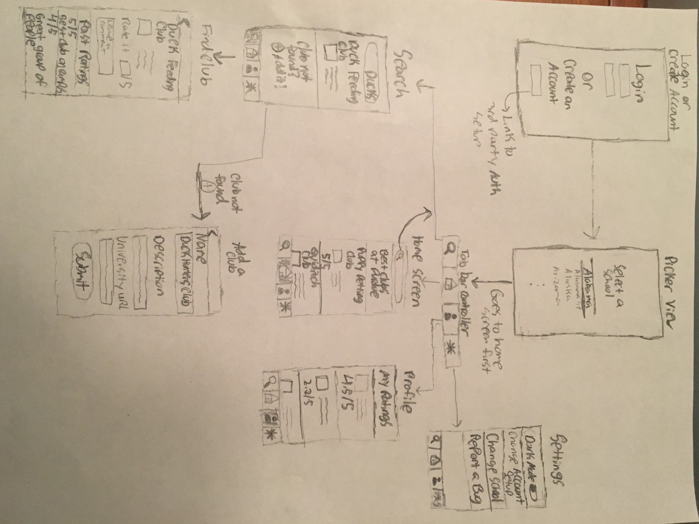

# README 

## 1. User Stories (Required and Optional)

**Required Must-have Stories**

 * Create an account
 * Login
 * Find their school
 * Add a club to the list of clubs
 * Find a specified club from list of clubs
 * Give the club a rating 
 
 
**Optional Nice-to-have Stories**

 * Leave a comment with the rating
 * Feed of best clubs on campus
 * Advanced search feature (by club topics)
 * Where my club meets map
 * User profiles

## 2. Screen Archetypes

 * Login or create an account
   * User can login
   * User can create an account
 * Search (for schools) 
   * User can search through a list of schools to find theirs
 * Feed (optional)
     * User can look at best rated clubs at school
 * Search (for clubs)
     * User can look for a club at their specified school
 * Detail
     * Club profile with past ratings and average rating
 * Creation
     * User can leave a rating/review of the club
 * Profile (optional)
     * Lists of users interests and past reviews and ratings
     * Can potentially see friends' ratings and network with them

## 3. Navigation

**Tab Navigation** (Tab to Screen)

 * Search (for clubs)
 * Feed
 * Profile
 * Settings

**Flow Navigation** (Screen to Screen)

 * Create an account
    * Login
 * Login 
     * Feed/Home Screen 
 * Home screen
   * Search (for clubs)
       * Detail (Club profile)
       * Creation of new rating entry
   * School feed
   * Profile
       * Can see own past ratings
   * Settings
     * Can customize app/change login method

## Wireframes



## Schema 
### Models
#### Login

   | Property      | Type     | Description |
   | ------------- | -------- | ------------|
   | authButton    | Button   | button that links user to third party authoriation |
   | signUpButton  | Button   | button that takes user to |
   
#### Picker View
   
   | Property      | Type     | Description |
   | ------------- | -------- | ------------|
   | schoolPicker  | Picker   | picker to select a school |
   | goButton       | Button   | takes highlighted school as selected school |

#### Home Screen
   | Property      | Type     | Description |
   | ------------- | -------- | ------------|
   | o     | String   | unique id for the user post (default field) |
   | author        | Pointer to User| image author |


#### Search
   | Property      | Type     | Description |
   | ------------- | -------- | ------------|
   | objectId      | String   | unique id for the user post (default field) |
   | author        | Pointer to User| image author |


#### Find Club
   | Property      | Type     | Description |
   | ------------- | -------- | ------------|
   | objectId      | String   | unique id for the user post (default field) |
   | author        | Pointer to User| image author |

#### Add a Club
   | Property      | Type     | Description |
   | ------------- | -------- | ------------|
   | objectId      | String   | unique id for the user post (default field) |
   | author        | Pointer to User| image author |


#### Profile
   | Property      | Type     | Description |
   | ------------- | -------- | ------------|
   | objectId      | String   | unique id for the user post (default field) |
   | author        | Pointer to User| image author |

#### Settings
   | Property      | Type     | Description |
   | ------------- | -------- | ------------|
   | objectId      | String   | unique id for the user post (default field) |
   | author        | Pointer to User| image author |

### Networking
   | Property      | Type     | Description |
   | ------------- | -------- | ------------|
   | objectId      | String   | unique id for the user post (default field) |
   | author        | Pointer to User| image author |

#### List of network requests by screen
   - Login/Create Account
      - (Read/GET) Query all posts where user is author
         ```swift
         let query = PFQuery(className:"Post")
         query.whereKey("author", equalTo: currentUser)
         query.order(byDescending: "createdAt")
         query.findObjectsInBackground { (posts: [PFObject]?, error: Error?) in
            if let error = error { 
               print(error.localizedDescription)
            } else if let posts = posts {
               print("Successfully retrieved \(posts.count) posts.")
           // TODO: Do something with posts...
            }
         }
         ```
      - (Create/POST) Create a new like on a post
      - (Delete) Delete existing like
      - (Create/POST) Create a new comment on a post
      - (Delete) Delete existing comment
   - Make A Club
      - (Create/POST) Create a new post object
   - Rate A Club
      - (Read/GET) Query logged in user object
      - (Update/PUT) Update user profile image


### Models
[Add table of models]
### Networking
- [Add list of network requests by screen ]
- [Create basic snippets for each Parse network request]
- [OPTIONAL: List endpoints if using existing API such as Yelp]
